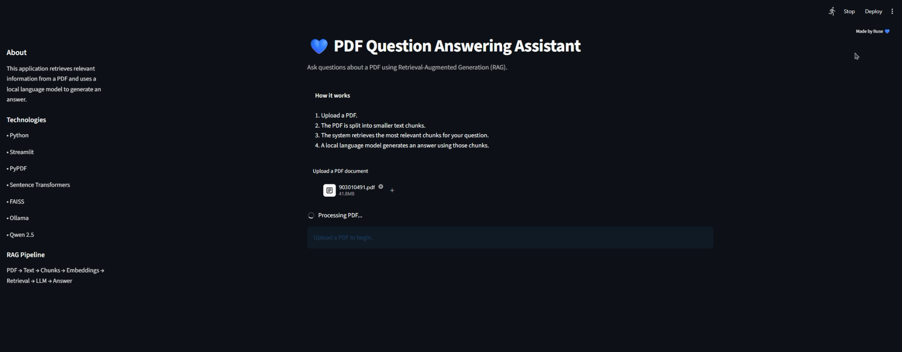
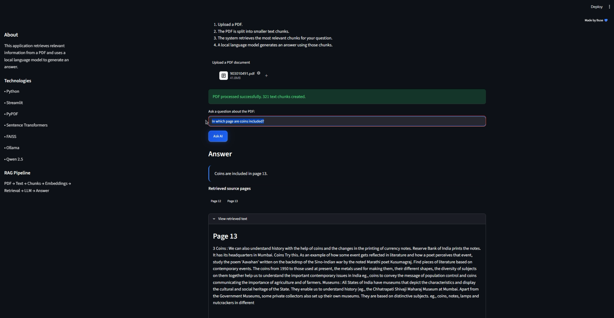

# PDF RAG Question Answering

A Streamlit-based question answering application that allows users to upload a PDF and ask questions about its content.

The application processes the document, converts it into searchable text chunks, retrieves the most relevant information with FAISS, and generates an answer using a local Ollama language model. Answers also include the source PDF page.

## Features

- Upload and process PDF documents
- Split PDF content into text chunks
- Create embeddings with Sentence Transformers
- Retrieve relevant content with FAISS
- Generate answers with Ollama and Qwen 2.5
- Display the source page for each answer

## Tech Stack

- Python
- Streamlit
- PyPDF
- Sentence Transformers
- FAISS
- Ollama
- Qwen 2.5

## Installation

`pip install -r requirements.txt`

Make sure Ollama is installed and the Qwen 2.5 model is available locally.

## Run the Application

`streamlit run app.py`

## Example

After uploading a PDF, the user can ask:

> In which page are coins included?

The application retrieves the relevant content and returns **Page 13** as the source page.

## Author

Buse Nur Eser  
Computer Engineering Graduate

## Screenshots

